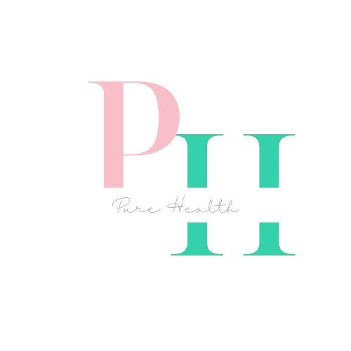

<h1 align="center"> 🩺 PURE HEALTH 🩺 </h1>

<h1 align="center">📋 Description </h1>

The primary objective of our website is to provide personalized guidance for each student from our school, and
 to support them to live a healthier life.

 
 
 
 
 
 
<h1 align="center">TEAM MEMBERS 👨🏻‍💻</h1>
<table >
  <tr>
    <td>Name</td>
    <td>Role</td>
   
  </tr>
  <tr>
    <td> Dimaya Noneva</td>
    <td>Front-end developer</td>
    
  </tr>
  <tr>
    <td>Stoyan Hristov</td>
    <td>Back-end developer</td>
   
  </tr>
  <tr>
    <td>Stiliyan Dimitrov</td>
    <td>Designer</td>
   
  </tr>
  <tr>
    <td>Jaklin Yankova</td>
    <td>Research and ethics</td>
   
  </tr>
   <tr>
    <td>Teodor Tanev</td>
    <td>Back-end developer</td>
  
  </tr>
  
</table> 
